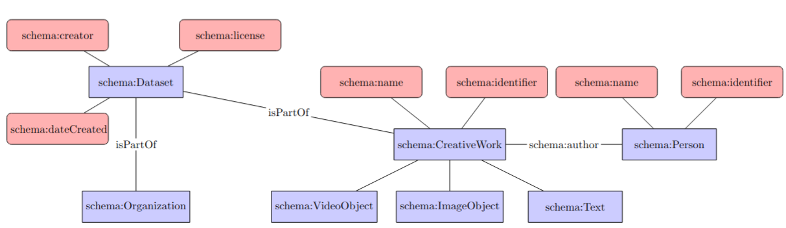

# chile-fellowship
Reproducible code to create Collection as data as part of the fellowship at the Pontificia Universidad Católica de Chile

[](https://mybinder.org/v2/gh/hibernator11/chile-fellowship/HEAD)

## Introduction
This work was done as part of a fellowship at the Pontificia Universidad Católica de Chile in August 2026. Several collections were selected and transformed into RDF using reproducible code. The datasets were reused using different methods and techniques.


## Authors

- Gustavo Candela, University of Alicante
- Nico Larrondo, Pontificia Universidad Católica de Chile
- Paul Spence, King's College London

## Use cases

- Archivo Eltit - Rosenfeld available at https://archivospatrimoniales.uc.cl/handle/123456789/31557

The Eltit-Rosenfeld Archive is a documentary collection created by the artist Lotty Rosenfeld and the writer Diamela Eltit in the late 1980s and early 1990s to preserve the testimonies and memory of the women’s movement for the right to vote in Chile. The folder datos includes the original XML data and the RDF generated as part of this work.

The following figure illustrates the data modelling process to transform the traditional metadata to Linked Open Data using as main ontology Schema.org. 



## Example of queries

This example of SPARQL query retrieves the works of the author Pablo Neruda in Wikidata combined with the works available at Biblioteca Virtual Miguel de Cervantes. It can be run in [this link](https://w.wiki/TJbo) using the Wikidata SPARQL endpoint. 

```
SELECT ?work ?workLabel ?origin 
WHERE {
{  
  BIND("Wikidata" as ?origin)
  ?work wdt:P50 wd:Q34189.
}
UNION
{
  BIND("BVMC" as ?origin)
  wd:Q34189 wdt:P2799 ?id
  BIND(uri(concat("https://data.cervantesvirtual.com/person/", ?id)) as ?bvmcID)
  SERVICE <http://data.cervantesvirtual.com/openrdf-sesame/repositories/data> {
    ?bvmcID <http://rdaregistry.info/Elements/a/authorOf> ?work .
    ?work rdfs:label ?workLabel
  }
}
  SERVICE wikibase:label { bd:serviceParam wikibase:language "es". }
} 
```

## Licence
<a rel="license" href="http://creativecommons.org/licenses/by/4.0/"></a><br />Content is licensed under a <a rel="license" href="http://creativecommons.org/licenses/by/4.0/">Creative Commons Attribution 4.0 International license</a>.

Please, note that the datasets used in this project have separate licences.

## Acknowledgements

We would like to thank the Pontificia Universidad Católica de Chile for giving us the opportunity to perform this work as part of a fellowship.

## References

- https://www.glamlabs.io/
- https://collectionsasdata.github.io/
